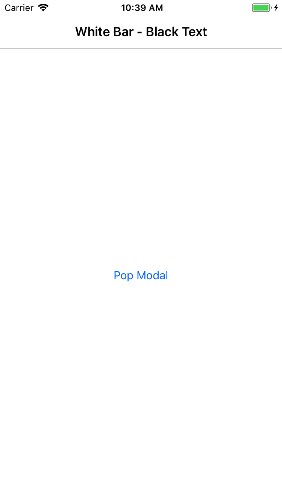

**In Xamarin Forms on iOS, when popping a modal that has changed the status bar text color, it is not returned to the correct color.**

By default on iOS in Xamarin Forms, the status bar text color changes to be appropriate when setting `BarTextColor` on a 
navigation page. This change happens when bar text color is changed and when the navigation page is loaded. It does not 
happen when a modal is popped.

Below is a screenshot with:
* A `NavigationPage` with `BarTextColor` set to `White`.
* A `NavigationPage` with `BarTextColor` set to `Black`, displayed as modal.
* The first `NavigationPage` after the modal has been popped.

Notice in the third screenshot the status bar is apparently blank (the text is black).

